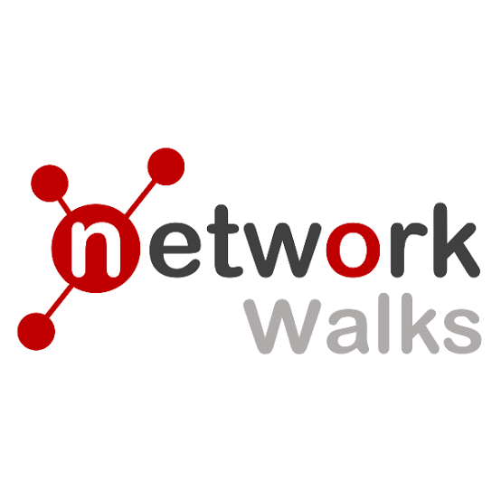

  

# 🎓 Cybersecurity Internship — Networkwalks Academy

## About This Repository
This repo documents my hands-on learning during my cybersecurity internship at
**Networkwalks Academy**, where I'm learning ethical hacking, penetration testing,
and network security fundamentals under the guidance of Waqas Karim (CCIE).

As part of the internship, I'm building and documenting a personal home lab
environment used for practicing penetration testing and cybersecurity concepts
in a safe, isolated setting.

## What I'm Learning
- Penetration Testing
- Ethical Hacking
- Network Security
- Cybersecurity Fundamentals
- Virtual Lab Environment Setup

## About Networkwalks Academy
Networkwalks Academy offers training in Ethical Hacking, Cybersecurity, Cisco
CCNA, AI, Linux, and Python Programming.

🌐 [networkwalks.com](https://networkwalks.com)

## Disclaimer
This repository is for **educational purposes only**, documenting practice in a
fully isolated, personal virtual lab environment. All techniques and tools
referenced here are intended strictly for learning and authorized security
practice — not for use against systems you don't own or have explicit
permission to test.

---

*Internship Duration: [ 09-August-2026 ] – [ ongoing ]*
*Mentor: Waqas Karim (CCIE)*
