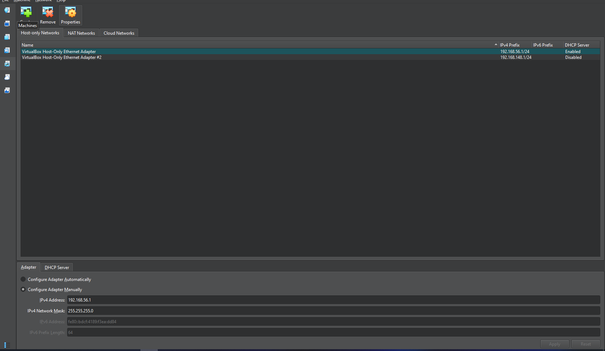
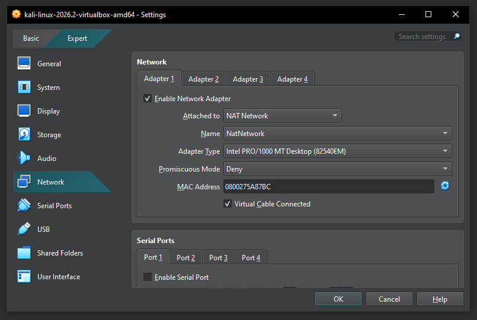
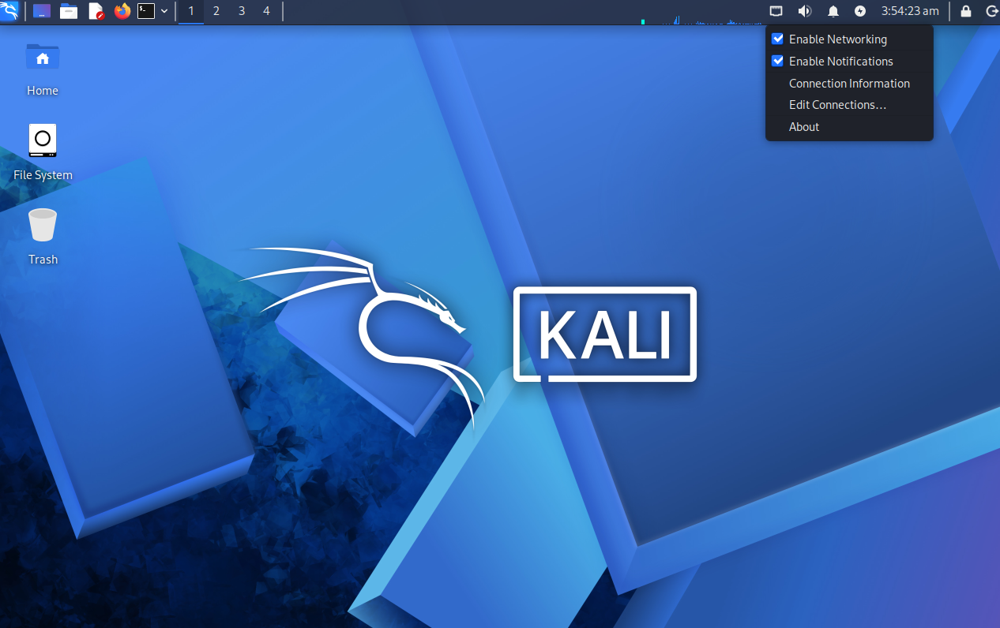
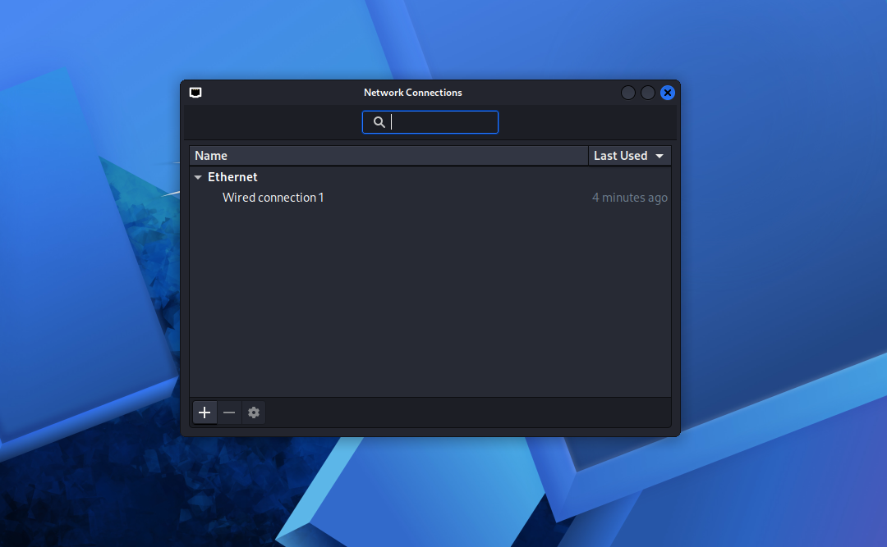
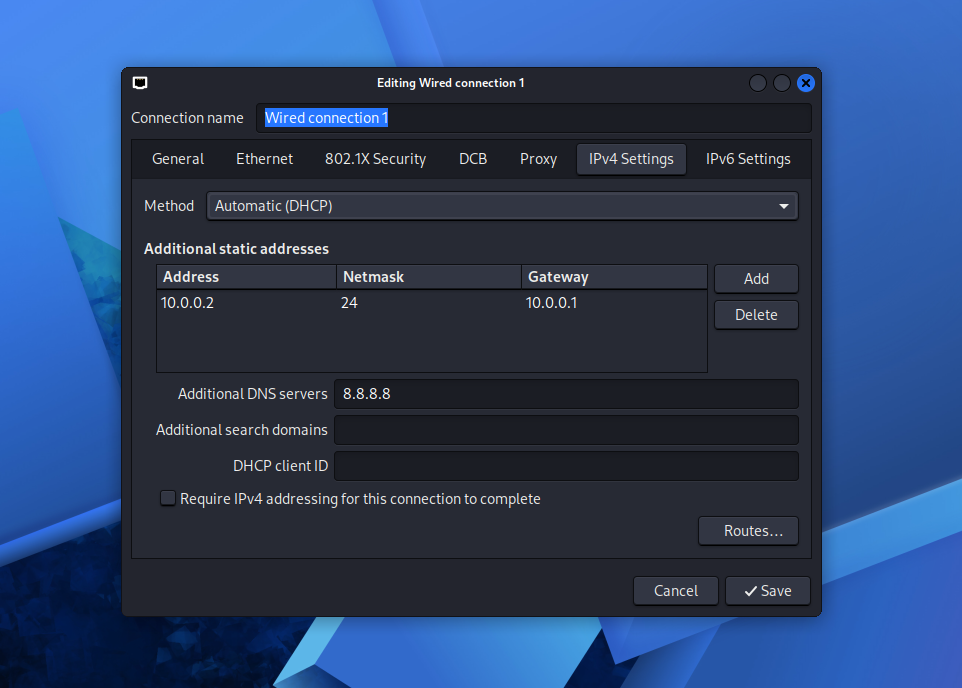
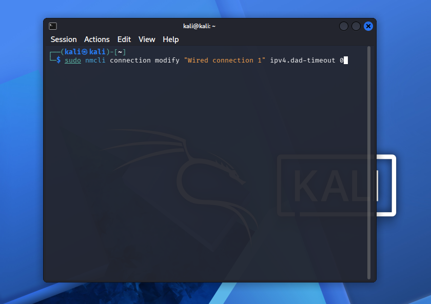
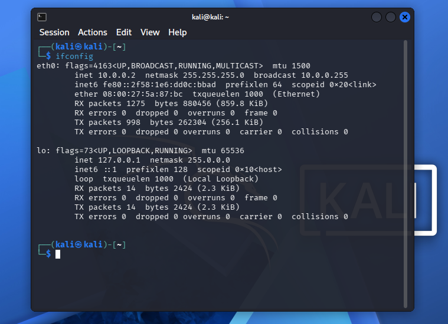
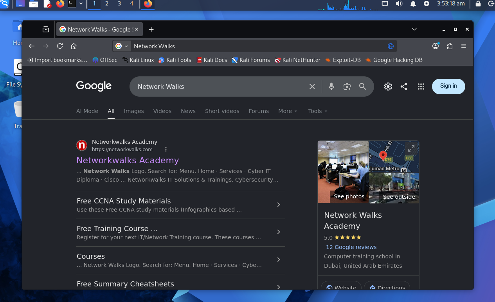
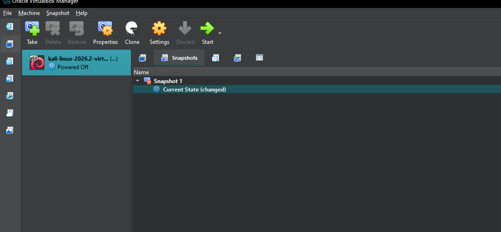

# 🛡️ Cyber Security Home Lab Setup — Kali Linux on VirtualBox

Personal lab notes from my internship at Networkwalks Academy, documenting how I built an isolated Kali Linux practice lab using VirtualBox **NAT Network** (not plain NAT), configured DNS, verified connectivity, and set up a snapshot/backup strategy.

---

## 🎯 Purpose of the Lab

The goal of this lab is to build a **safe, isolated sandbox environment** for practicing ethical hacking and penetration testing techniques, without any risk to my host machine, home network, or any real-world system.

- **Why a sandbox?** Pentesting tools and techniques (exploits, scans, malware analysis, etc.) can be destructive or unpredictable. A sandbox lets me break things, make mistakes, and learn freely without consequences.
- **Why an isolated network?** Using a custom VirtualBox **NAT Network** (`10.0.0.0/24`) keeps all lab traffic contained to a private virtual switch. VMs can talk to each other (needed to attack/scan one VM from another) and reach the internet for updates/downloads, but the lab never touches or exposes my real home network or other devices on it.

---

## 🖥️ Lab Environment Details

| Component | Detail |
|---|---|
| **Host Machine** | Windows 10, Core i3/i5 (or similar), 8GB RAM or more, 256GB SSD or more |
| **Hypervisor** | Oracle VirtualBox (latest stable release) |
| **Guest OS** | Kali Linux 2026.2 (VirtualBox 64-bit image) |
| **Network Type** | Custom VirtualBox **NAT Network** (`NatNetwork`) |
| **IP Range** | `10.0.0.0/24` |
| **Kali Static IP** | `10.0.0.2` |
| **Gateway** | `10.0.0.1` |
| **DNS** | `8.8.8.8` (fallback: `10.0.0.1`) |

---

## 🧰 Tools and Links Used

| Tool | Purpose | Link |
|---|---|---|
| **7-Zip** | Extracts compressed VM files (`.7z`, `.zip`) | https://7-zip.org/download.html |
| **VirtualBox** | Runs the virtual machines | https://virtualbox.org/wiki/Downloads |
| **Kali Linux VM image** | The pentesting OS itself | https://kali.org/get-kali |
| **nmcli** | Built-in Kali command-line tool for network configuration/troubleshooting | Pre-installed on Kali |

---

## 🛠️ Step-by-Step Build

### Step 1: Install 7-Zip

**What:** Downloaded and installed 7-Zip from the official site.
**Why:** Kali Linux is distributed as a `.7z` compressed archive — 7-Zip is needed to extract it before importing into VirtualBox.

1. Go to https://7-zip.org/download.html
2. Download the version matching your system (32-bit or 64-bit Windows)
3. Run the installer, click through with default options

---

### Step 2: Install VirtualBox

**What:** Installed Oracle VirtualBox on the host machine.
**Why:** VirtualBox is the hypervisor that runs all the virtual machines in the lab — it's the foundation everything else sits on.

1. Go to https://virtualbox.org/wiki/Downloads
2. Download the Windows host version
3. Run the installer — keep default settings, allow any driver installation pop-ups
4. Launch **Oracle VM VirtualBox Manager** to confirm it opens correctly

---

### Step 3: Download & Extract Kali Linux

**What:** Downloaded the pre-built Kali Linux VirtualBox image and extracted it.
**Why:** Using the pre-built VM image (instead of the ISO installer) saves time — Kali comes pre-installed and pre-configured with pentesting tools.

1. Go to https://kali.org/get-kali
2. Choose **Virtual Machines** (not the ISO installer)
3. Download the **VirtualBox 64-bit** version
4. Right-click the `.7z` file → **7-Zip → Extract Here**
5. This produces a folder containing a `.vbox` file and virtual disk files

---

### Step 4: Import Kali into VirtualBox

**What:** Imported the extracted Kali VM into VirtualBox.
**Why:** This registers Kali as a usable virtual machine that VirtualBox can boot and manage.

1. Open **VirtualBox Manager**
2. Go to **File → Import Appliance**
3. Browse to the extracted Kali folder and select the `.vbox` (or `.ova`) file
4. Click **Next**, review the settings (default RAM/CPU is fine), click **Import**
5. Wait for the import to finish — Kali now appears in the VM list

---

### Step 5: Create the NAT Network in VirtualBox

**What:** Created a custom NAT Network (`10.0.0.0/24`) inside VirtualBox.
**Why:** Plain "NAT" mode only lets a single VM reach the internet — VMs can't see each other. **NAT Network** creates a private virtual switch so all VMs (Kali, Windows, Android, etc.) can talk to *each other* AND reach the internet — essential for a pentesting lab where you attack one VM from another.

1. Open **Oracle VM VirtualBox Manager**
2. Go to **File → Tools → Network**
3. Click the **NAT Networks** tab
4. Click **Create** → rename it `NatNetwork` if it isn't already
5. Set:
   - **IPv4 Prefix:** `10.0.0.0/24`
   - **Enable DHCP:** checked (optional — this lab uses manual/static IPs)
6. Click **Apply**

> 📝 Note: the screenshot below shows the *Host-only Networks* tab, a **different** network type (connects the VM only to the host PC, not other VMs). For this lab, use the **NAT Networks** tab specifically.


*VirtualBox's Network Manager window — Host-only Networks tab is shown here, but for this lab you want the "NAT Networks" tab next to it.*

---

### Step 6: Attach the Kali VM to the NAT Network

**What:** Configured Kali's network adapter to attach to the custom NAT Network.
**Why:** Without this, Kali would default to plain NAT or no network at all, and wouldn't be able to communicate with other lab VMs.

1. Right-click the Kali VM → **Settings**
2. Go to **Network** → **Adapter 1** tab
3. Check ✅ **Enable Network Adapter**
4. Set:
   - **Attached to:** `NAT Network`
   - **Name:** `NatNetwork`
   - **Promiscuous Mode:** `Deny` (default; only switch to **Allow All** for packet sniffing/traffic capture exercises)
5. Click **OK**


*Kali's Adapter 1 attached to "NAT Network", with Promiscuous Mode set to Deny.*

---

### Step 7: Boot Kali and Open Network Settings

**What:** Opened Kali's internal network connection settings.
**Why:** VirtualBox handles the *virtual* network adapter, but Kali's OS-level network settings (IP, DNS) still need to be configured separately, inside the guest OS itself.

1. Start the Kali VM
2. Click the **network icon** top-right of the taskbar
3. Click **Edit Connections...**


*Click the network icon top-right → "Edit Connections..."*

4. This opens **Network Connections**, showing `Wired connection 1`
5. Select it, click the **gear icon** (⚙) to edit


*The Wired connection 1 entry — select it, then click the gear/settings icon to edit.*

---

### Step 8: Set the Static IP Address and DNS

**What:** Assigned Kali a fixed static IP and DNS server.
**Why:** A static IP (rather than DHCP-assigned) keeps Kali's address predictable and consistent every time the lab is used — important when other VMs need to reliably target/scan it by a known IP.

1. Go to the **IPv4 Settings** tab
2. Under **Additional static addresses**, click **Add**:
   - **Address:** `10.0.0.2`
   - **Netmask:** `24`
   - **Gateway:** `10.0.0.1`
3. **Additional DNS servers:** `8.8.8.8` (Google Public DNS, so Kali can resolve domain names)
   - If internet issues occur, switch DNS to `10.0.0.1` (VirtualBox's internal NAT Network gateway/DNS)
4. Click **Save**


*Static address 10.0.0.2/24, gateway 10.0.0.1, and DNS set to 8.8.8.8.*

---

## ⚠️ Problems Faced & How They Were Solved

**Problem:** On Kali 2026.1+, the network connection sometimes hangs and fails to get internet access after applying a static IP.

**Cause:** A known bug related to IPv4 "Duplicate Address Detection" (DAD) taking too long to complete on newer Kali/NetworkManager versions.

**Solution:** Ran the following command in a terminal to disable the DAD timeout:

```bash
sudo nmcli connection modify "Wired connection 1" ipv4.dad-timeout 0
```

Entered the sudo password when prompted, then reconnected the network (or rebooted the VM) — this resolved the issue and internet access worked normally afterward.


*Running the fix command in the terminal.*

---

## ✅ Verification Tests

After configuration, the following checks were run to confirm the lab network was functioning correctly:

### 1. Verify IP Configuration (`ifconfig`)
Confirms the static IP was actually applied to the `eth0` interface.

```bash
ifconfig
```

Expected/observed output on `eth0`:
- `inet 10.0.0.2`
- `netmask 255.255.255.0`
- `broadcast 10.0.0.255`


*ifconfig confirms eth0 has IP 10.0.0.2 with the correct netmask.*

### 2. Ping the Gateway
Confirms Kali can reach the NAT Network's internal gateway.

```bash
ping 10.0.0.1
```

### 3. Ping Between VMs
Once additional VMs (Windows, Android, etc.) are added to the same NAT Network, ping each one from Kali by its assigned static IP to confirm inter-VM communication works, e.g.:

```bash
ping 10.0.0.10   # Windows 10 VM
```

### 4. `ip a` Output
An alternative/additional way to verify interface and IP assignment:

```bash
ip a
```
This should list `eth0` with the address `10.0.0.2/24`, matching the `ifconfig` result above.

### 5. Internet Connectivity Test (Browser)
Confirms DNS resolution and internet routing both work end-to-end through the NAT Network.

1. Open **Firefox** from the taskbar
2. Search for anything (e.g., "Network Walks") and confirm the page loads


*If search results load, DNS (8.8.8.8) and NAT Network internet routing are both working correctly.*

---

## 💾 Snapshot & Backup Strategy

**Strategy:** Take a snapshot immediately after any working, stable configuration — before beginning any risky or experimental activity (e.g., running exploits, installing untested tools, modifying system files).

**Why this matters:** Pentesting labs are meant to be broken and rebuilt. Rather than reinstalling Kali from scratch every time something goes wrong, a snapshot lets me roll back to a known-good state in seconds.

**Process followed:**
1. Powered off the VM (snapshotting while running is also possible)
2. In VirtualBox Manager, selected the Kali VM
3. Clicked **Snapshot** tab → **Take Snapshot**
4. Named it clearly, e.g. `Clean Install - Working Network`
5. Clicked **OK**


*Snapshot 1 created, with "Current State (changed)" shown below it — meaning further changes can always be rolled back to this snapshot.*

**Ongoing plan:** A new snapshot will be taken at the end of each lab session or before starting a new, higher-risk exercise (e.g., before installing Metasploit modules, before testing exploits against target VMs), so there's always a reliable rollback point.

---

## 📚 What I Learned This Week

- The difference between plain **NAT** and **NAT Network** in VirtualBox, and why isolated inter-VM communication requires the latter
- How to configure static IP addressing and DNS inside a Linux guest OS (via NetworkManager GUI)
- How to diagnose and fix a real-world network bug (`ipv4.dad-timeout`) using the command line
- How to verify network connectivity systematically using `ifconfig`, `ip a`, `ping`, and a browser-based test
- The importance of a structured snapshot/backup strategy before doing any risky experimentation in a pentesting lab
- The value of documenting *why* each step was done, not just *what* was done — for both my own reference and reproducibility

---

## ✅ Quick Recap Checklist

- [ ] Downloaded & installed 7-Zip
- [ ] Downloaded & installed VirtualBox
- [ ] Downloaded & extracted Kali Linux VM
- [ ] Imported Kali into VirtualBox
- [ ] Created **NAT Network** (`10.0.0.0/24`) — *not* Host-only
- [ ] Attached Kali's Adapter 1 to that NAT Network
- [ ] Set static IP `10.0.0.2/24`, gateway `10.0.0.1`
- [ ] Set DNS to `8.8.8.8` (fallback: `10.0.0.1`)
- [ ] Ran the `nmcli` DAD-timeout fix (Kali 2026.1+)
- [ ] Verified IP with `ifconfig` and `ip a`
- [ ] Pinged the gateway (`10.0.0.1`)
- [ ] Tested internet in Firefox
- [ ] Took a snapshot

---

## 📌 Reference IP Plan (for future VMs in this lab)

| VM              | Static IP    |
|------------------|-------------|
| Kali Linux       | 10.0.0.2    |
| Windows 7        | 10.0.0.7    |
| Android          | 10.0.0.9    |
| Windows 10       | 10.0.0.10   |
| Windows 11       | 10.0.0.11   |
| Server 2016      | 10.0.0.16   |

All on the same **NatNetwork**, `10.0.0.0/24`, so they can all ping/scan/attack each other during future exercises.

---

## 👤 Author Info

**Name:** [Your Full Name]
**Batch:** [Your Batch Name/Number]
**LinkedIn:** [Your LinkedIn Profile URL]
**Internship:** Cybersecurity Internship — Networkwalks Academy
**Mentor:** Waqas Karim (CCIE)

---

*Lab based on internship training — Networkwalks Academy Cyber Lab Setup Guide.*
