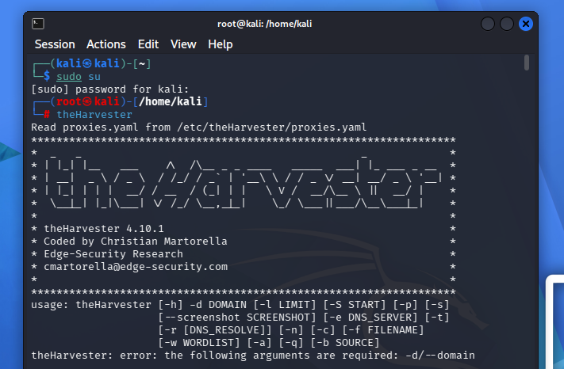
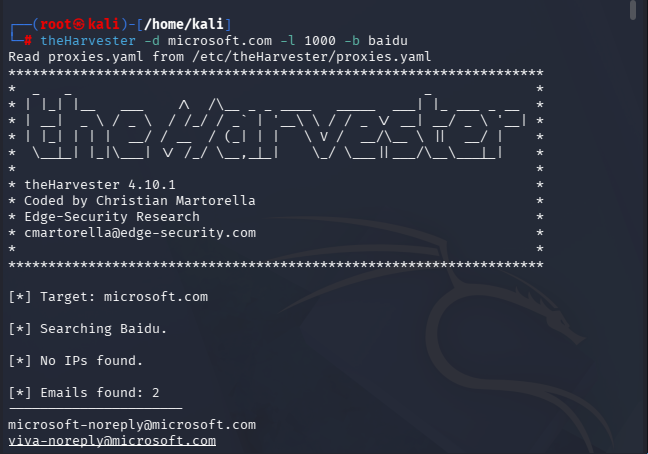
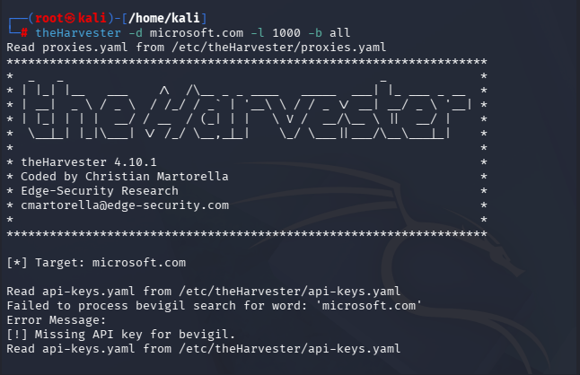

# 🕵️‍♂️ Week 2 – Passive Reconnaissance with theHarvester

**Internship Lab Log | Network Security Track** 🔐


This README documents a lab I completed during my internship, focused on **passive information gathering (OSINT reconnaissance)** using the tool **theHarvester** 🌾. It covers what theHarvester is, how it works, the basic commands used, how it collects data passively, which search engines/sources it queries, how it integrates with the **Shodan API** 🛰️, and walkthroughs of the two tasks I performed against `microsoft.com`.

---

## 📖 Table of Contents

- [1. What is theHarvester?](#1--what-is-theharvester)
- [2. Why Passive Recon Matters](#2--why-passive-reconnaissance-matters)
- [3. Basic Commands](#3--basic-theharvester-commands)
- [4. How It Gathers Info Passively](#4--how-theharvester-gathers-information-passively)
- [5. Search Engines & Sources](#5--search-engines--sources-supported)
- [6. theHarvester + Shodan API](#6--theharvester--the-shodan-api)
- [7. Lab Walkthrough](#7--lab-walkthrough)
- [8. Key Takeaways](#8--key-takeaways)
- [9. Environment](#9--environment)
- [Folder Structure](#-repository--folder-structure)

---

## 1. 🌐 What is theHarvester?

**theHarvester** is an open-source **OSINT (Open Source Intelligence) reconnaissance tool** 🔍 used during the early, passive phase of a penetration test or security assessment. It comes pre-installed on Kali Linux 🐉 and was created by **Christian Martorella** (Edge-Security Research).

Its purpose is to collect publicly available information about a target **domain or organization** 🏢 without ever directly interacting with (touching/scanning) the target's own infrastructure. Instead, it queries third-party public sources — search engines, DNS repositories, certificate transparency logs, and OSINT/security APIs — and aggregates whatever is exposed about the target.

Typical data theHarvester collects includes:

- 🌍 Subdomains / hostnames
- 📧 Email addresses
- 🖥️ IP addresses
- 🔢 ASNs (Autonomous System Numbers)
- 👤 Employee names (from sources like LinkedIn, when configured)
- 🔓 Open ports / banners (when paired with Shodan)
- 🔗 Interesting URLs (login portals, OAuth endpoints, etc.)

Because it never sends packets directly to the target, this stage of recon is considered **passive** ✅ and low-risk — it doesn't "touch" the target the way active scanning (e.g., Nmap) does.

---

## 2. 🎯 Why Passive Reconnaissance Matters

Before any active testing (port scanning, vulnerability scanning, exploitation) begins, penetration testers and red teamers build a picture of the target's external "attack surface" using only public information. This helps:

- 🗺️ Map out subdomains and services that may not be obvious from the main website
- ✉️ Identify email naming conventions (useful for phishing simulations / social engineering assessments)
- 🕳️ Discover forgotten or unlisted infrastructure (staging/dev/test subdomains)
- 📡 Identify exposed hosts/services indexed by services like Shodan
- 🤫 Do all of this **without alerting the target**, since no direct traffic touches their systems

---

## 3. ⌨️ Basic theHarvester Commands

The general syntax is:

```bash
theHarvester -d <domain> -l <limit> -b <source>
```

| Flag | Meaning |
|------|---------|
| `-d` | 🎯 Target **domain** to investigate (e.g., `microsoft.com`) |
| `-l` | 🔢 **Limit** — maximum number of results to fetch from each source |
| `-b` | 🔌 **Source/engine** to query (e.g., `baidu`, `bing`, `crtsh`, `shodan`, or `all`) |
| `-S` | ⏭️ Start result index (used for pagination) |
| `-p` | 🔓 Enable port scanning on discovered hosts |
| `-s` | 🖧 Perform DNS server discovery |
| `-e` | 🌐 Specify a custom DNS server |
| `-n` | 🧩 Perform a DNS brute-force/expansion |
| `-c` | 📛 Perform DNS brute-forcing of common subdomain names |
| `-f` | 💾 Save results to a file (e.g., `-f output.html/xml`) |
| `-v` | ✅ Verify hostnames via DNS resolution |
| `-t` | 🌳 Perform DNS TLD expansion discovery |

Running `theHarvester` with no arguments (or `-h`) displays the usage/help banner, confirming the tool version and required arguments:



> 🖼️ *Above: theHarvester 4.10.1 running on Kali Linux, showing it requires at minimum a `-d` (domain) and a `-b` (source) argument.*

---

## 4. 🕶️ How theHarvester Gathers Information Passively

theHarvester does not scan or probe the target directly. Instead it works like this:

1. 🎯 **You specify a target domain** (`-d microsoft.com`) and a **source** to query (`-b baidu`, `-b all`, etc.).
2. 🔎 theHarvester sends **search queries** to the chosen public source(s) — e.g., it searches a search engine for pages/results mentioning `microsoft.com`.
3. 🧠 It **parses the responses** returned by that third-party service (search results, certificate logs, DNS records already published, etc.) and extracts anything relevant: email addresses, subdomains, hostnames, IPs.
4. 🥷 Because the tool only talks to the *search engine / third-party service*, and not to Microsoft's own servers, **the target organization has no way of knowing this reconnaissance is happening.**
5. 📊 Results from all queried sources are **aggregated and deduplicated**, then displayed in categories: IPs, Emails, Hosts, ASNs, Interesting URLs, LinkedIn Links, etc.

This is the core idea of "passive" OSINT: leverage information that is *already public and already indexed elsewhere*, rather than actively probing the target.

---

## 5. 🔍 Search Engines & Sources Supported

theHarvester can pull from a long list of sources via the `-b` flag, including (but not limited to):

- 🔎 **Search engines:** Baidu, Bing, DuckDuckGo, Yahoo
- 📜 **Certificate transparency logs:** crt.sh, CertSpotter
- 🌐 **DNS/subdomain aggregators:** RapidDNS, Subdomain Center, Robtex, HackerTarget, Subdomainfinderc99, DNSDumpster (needs key)
- 🚨 **Threat intel / breach data:** Hudson Rock, OTX (AlienVault), LeakIX, ThreatCrowd, HaveIBeenPwned (needs key)
- 💻 **Code/repo leakage:** GitHub, GitLab, Bitbucket (needs key)
- 🛰️ **Internet-wide scan engines:** **Shodan**, Censys, ZoomEye, Netlas, FOFA, Onyphe, CriminalIP (all need API keys)
- 🕰️ **Historical data:** Wayback Machine (Waybackarchive), Common Crawl
- 🏗️ **Business/tech profiling:** BuiltWith, SecurityScorecard, WhoisXML
- ⭐ **Special:** `-b all` — queries **every configured source** in a single run

Many of these advanced sources (Shodan, Censys, ZoomEye, VirusTotal, Hunter, DeHashed, etc.) require an **API key** 🔑 configured in `/etc/theHarvester/api-keys.yaml`. Without a key, theHarvester simply reports "Missing API key" for that source and continues gracefully with the rest.

---

## 6. 🛰️ theHarvester + the Shodan API

**Shodan** is a search engine for internet-connected devices — it continuously scans the internet and indexes information about **open ports, running services, banners, SSL certificates, and device/software versions** for publicly reachable hosts.

When theHarvester is configured with a valid **Shodan API key** 🔑 (in `/etc/theHarvester/api-keys.yaml`), the `-b shodan` (or `-b all`) source works as follows:

1. 📥 theHarvester takes the **hostnames/IP addresses** it has already discovered for the target domain (from DNS, search engines, cert logs, etc.).
2. 📤 It sends these IPs/hosts to the **Shodan API** as queries.
3. 📡 Shodan returns any **pre-indexed scan data** it has for those hosts — such as open ports, banner text, service versions, and geolocation — all from Shodan's own prior internet-wide scanning, **not** from theHarvester scanning the target itself.
4. 🧩 This enriches the recon report with a picture of what services/ports are exposed on the target's infrastructure, still without theHarvester directly touching the target.

In this lab, the Shodan source was attempted as part of the `-b all` run, but it returned:

```
A Missing Key error occurred in Shodan search:
[!] Missing API key for Shodan.
```

⚠️ This is expected behavior — without registering a free/paid Shodan API key and adding it to `api-keys.yaml`, theHarvester cannot query Shodan and simply skips that source while continuing with the others.

---

## 7. 🧪 Lab Walkthrough

### 📌 Task 1 — Single-Source Scan (`-b baidu`)


**Command used:**
```bash
theHarvester -d microsoft.com -l 1000 -b baidu
```

This command tells theHarvester to search **only the Baidu search engine** 🇨🇳 for information related to `microsoft.com`, with a result limit of 1000.



**Results obtained:**


- **Emails found (2):** `microsoft-noreply@microsoft.com`, `viva-noreply@microsoft.com`
- **Hosts found (11):** including `learn.microsoft.com`, `account.microsoft.com`, `support.microsoft.com`, `developer.microsoft.com`, `windowsupdate.microsoft.com`, and others
- No IPs or people were found from this single source

💡 This shows that even a single search engine source can reveal real subdomains and email address formats belonging to the organization — useful early-stage recon.

---

### 📌 Task 2 — Full Multi-Source Scan (`-b all`)


**Command used:**
```bash
theHarvester -d microsoft.com -l 1000 -b all
```

This tells theHarvester to query **every configured source at once** ⭐ — search engines, certificate transparency logs, DNS aggregators, threat-intel feeds, and API-based engines like Shodan (where keys are configured).



**What happened:**

- 🔒 Sources requiring API keys (Bevigil, Bitbucket, BuiltWith, Brave, Censys, CriminalIP, DeHashed, DNSDumpster, FullHunt, GitHub, HaveIBeenPwned, Hunter, IntelX, Netlas, Onyphe, PentestTools, ProjectDiscovery, RocketReach, SecurityScorecard, SecurityTrails, **Shodan**, Tomba, Venacus, VirusTotal, WhoisXML, ZoomEye) all reported `Missing API key` and were skipped — theHarvester degrades gracefully instead of crashing. ✅
- 🆓 Free/keyless sources still ran successfully: **Baidu, Chaos, CertSpotter, CRTsh, DuckDuckGo, HackerTarget, Hudson Rock, CommonCrawl, OTX, LeakIX, RapidDNS, Subdomain Center, Robtex, THC, ThreatCrowd, Urlscan, Subdomainfinderc99, Windvane (DNS fallback), Yahoo, GitLab, Wayback Machine**.

**Aggregated results:**


- **ASNs found (6):** AS13335, AS133618, AS206834, AS38719, AS40034, AS8075
- **Interesting URLs (2):** including a Microsoft OAuth2 login/authorize endpoint and a Teams support page
- **IPs found:** 117 unique IP addresses tied to Microsoft infrastructure
- **Emails found (7):** including `postmaster@microsoft.com`, `secure@microsoft.com`, `opencode@microsoft.com`, `wehelp@microsoft.com`, and others
- **Hosts found:** 10,000 (the maximum returned) — an enormous number of Microsoft subdomains covering Azure, Bing Ads, Copilot, Teams, internal corp domains, cloud services, and more

🚀 This clearly demonstrates the power of combining many passive sources: what a single search engine (Task 1) revealed as ~11 hosts and 2 emails ballooned to **10,000 hosts, 117 IPs, and 7 emails** once every available source was aggregated together.

---

## 8. ✅ Key Takeaways

- 🕶️ theHarvester is a **passive** OSINT tool — it never directly contacts the target, only public third-party sources.
- 🔌 The `-b` flag controls which source(s) are queried; `-b all` maximizes coverage but is slower and needs API keys for full functionality.
- 🆓 Free sources (Baidu, DuckDuckGo, crt.sh, RapidDNS, Wayback Machine, etc.) already provide meaningful results with **no configuration**.
- 🔑 Premium sources like **Shodan**, Censys, VirusTotal, and SecurityTrails add powerful data (like open ports/services) but require registering for **API keys** first.
- 🥇 Passive recon like this is typically the **first step** in a penetration test, used to build a target's attack surface map before any active scanning begins.

---

## 9. 🖥️ Environment


- **OS:** Kali Linux (root shell) 🐉
- **Tool:** theHarvester v4.10.1 🌾
- **Target used for demonstration:** `microsoft.com` (public domain, used purely for educational/lab purposes) 🎓

> ⚠️ **Disclaimer:** This lab was performed strictly for **educational purposes** as part of an internship training exercise. All reconnaissance was passive (no direct scanning of target infrastructure) and used a well-known public domain purely as a demonstration target.

---

## 📁 Repository / Folder Structure

```
Week2-PM4/
├── README.md
├── Task1/
│   ├── image5.png    # 🧾 Tool banner/usage
│   ├── image6.png    # 🔎 Single source (-b baidu) scan
│   └── task1.txt        # Raw terminal output/log
└── Task2/
    ├── image7.png    # 🌐 Full (-b all) multi-source scan
    └── Task2.txt         # Raw terminal output/log
```

---

<p align="center">
  Made with 💻 + ☕ during my Network Security Internship
</p>
