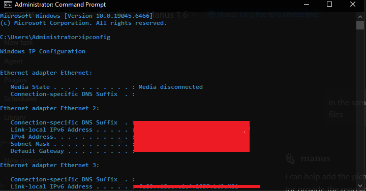
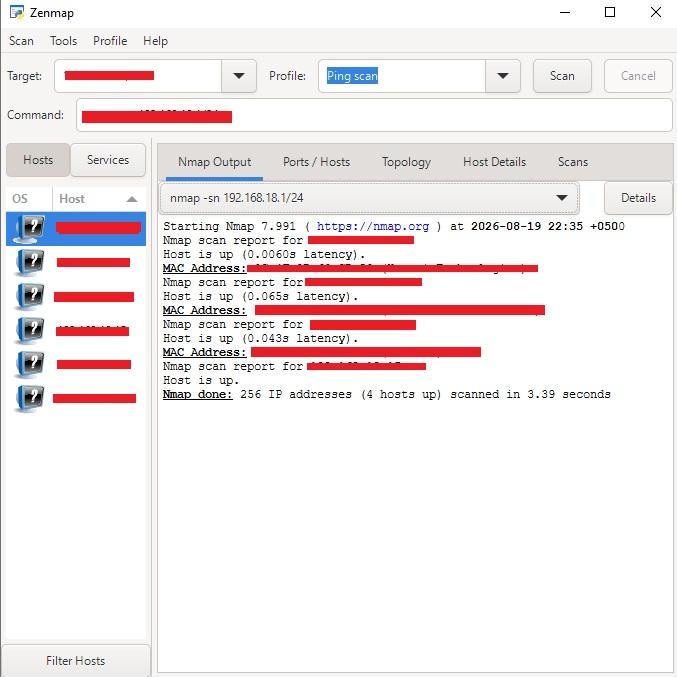
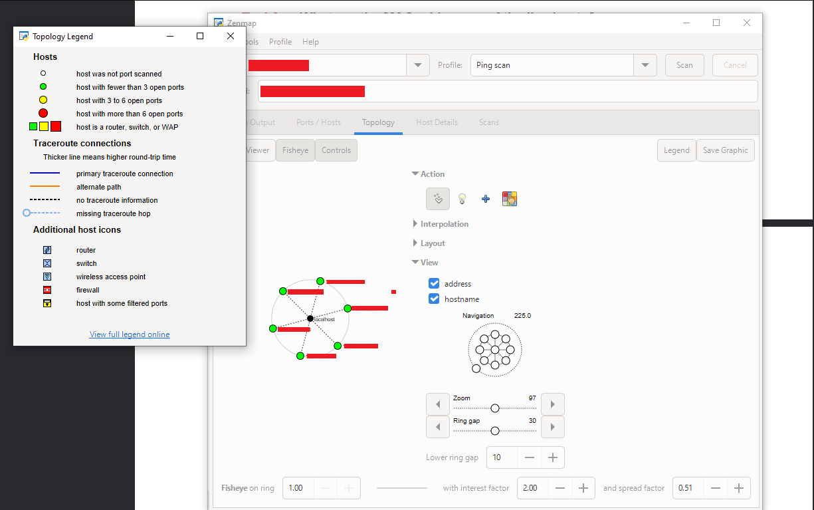

# 🗺️ Week 2 – Network Scanning with Zenmap (Nmap GUI)

**Internship Lab Log | Network Security Track** 🔐


This README documents a lab I completed during my internship, focused on **active network scanning** using **Zenmap** 🗺️ — the official graphical front-end for **Nmap** 📡. It explains what Zenmap and Nmap are, how scanning works, the basic commands/profiles used, how to read the results, and a walkthrough of the scan I performed on my local network.

---

## 📖 Table of Contents

- [1. What is Nmap?](#what-is-nmap)
- [2. What is Zenmap?](#what-is-zenmap)
- [3. Zenmap Interface Overview](#zenmap-interface-overview)
- [4. Basic Nmap/Zenmap Commands & Scan Profiles](#basic-commands)
- [5. How Scanning Works (Step by Step)](#how-scanning-works)
- [6. Lab Walkthrough](#lab-walkthrough)
- [7. Reading the Topology Map](#reading-the-topology-map)
- [8. Key Takeaways](#key-takeaways)
- [9. Environment](#environment)
- [Folder Structure](#folder-structure)

---

<a id="what-is-nmap"></a>
## 1. 📡 What is Nmap?

**Nmap** (**N**etwork **Map**per) is a free, open-source command-line tool used for **network discovery and security auditing**. It is one of the most widely used tools in networking and cybersecurity, allowing you to:

- 🖥️ Discover **live hosts** on a network
- 🔓 Discover **open ports** and running **services** on those hosts
- 🧬 Fingerprint the **operating system** and **service versions**
- 🛡️ Detect basic **firewall/filtering** behavior
- 🧪 Run **NSE (Nmap Scripting Engine)** scripts for vulnerability checks

Unlike theHarvester (passive OSINT), Nmap performs **active reconnaissance** — it sends packets *directly* to the target machines and analyzes their responses. This means the target's network (firewalls, IDS/IPS) **can** detect this activity, which is why Nmap scanning is normally only done with authorization, on networks you own or are permitted to test.

---

<a id="what-is-zenmap"></a>
## 2. 🗺️ What is Zenmap?

**Zenmap** is the **official graphical user interface (GUI)** for Nmap. It was built to make Nmap easier to use for people who prefer a visual interface over memorizing command-line flags.

Zenmap gives you:

- 📝 A **Command** bar that shows the exact Nmap command being run (great for learning the CLI syntax!)
- 🎛️ **Pre-built scan profiles** (Ping scan, Quick scan, Intense scan, etc.) selectable from a dropdown
- 📊 Multiple result tabs: **Nmap Output**, **Ports/Hosts**, **Topology**, **Host Details**, and **Scans**
- 🌐 A visual **Topology map** showing discovered hosts and how they relate to each other
- 💾 The ability to **save scan results/profiles** for later comparison

In short: **Zenmap = Nmap's engine + a friendly visual dashboard**, making it a great tool for beginners learning network scanning.

---

<a id="zenmap-interface-overview"></a>
## 3. 🖼️ Zenmap Interface Overview

| Section | Purpose |
|---|---|
| 🎯 **Target** | The IP address, hostname, or IP range/subnet you want to scan (e.g., `192.168.18.1/24`) |
| 📋 **Profile** | A dropdown of pre-configured scan types (Ping scan, Intense scan, Quick scan, etc.) |
| ▶️ **Scan / Cancel** | Buttons to start or stop the scan |
| ⌨️ **Command** | Auto-generated Nmap CLI command based on your Target + Profile choice |
| 🖥️ **Hosts / Services** (left panel) | Lists every discovered host, color-coded by OS icon |
| 📄 **Nmap Output** | Raw text output of the scan, identical to what you'd see running Nmap in a terminal |
| 🔌 **Ports/Hosts** | Table view of open/closed/filtered ports per host |
| 🌐 **Topology** | Visual network map showing hosts as nodes connected to your machine |
| 🧾 **Host Details** | OS guesses, uptime, MAC vendor, and other metadata for a selected host |
| 📁 **Scans** | History/log of scans run in the current session |

---

<a id="basic-commands"></a>
## 4. ⌨️ Basic Nmap/Zenmap Commands & Scan Profiles

Zenmap's **Profile** dropdown maps directly to real Nmap commands under the hood. Here are the most common ones:

| Zenmap Profile | Equivalent Nmap Command | What it Does |
|---|---|---|
| 🏓 **Ping scan** | `nmap -sn <target>` | Discovers **live hosts only** — no port scanning. Fastest option. |
| ⚡ **Quick scan** | `nmap -T4 -F <target>` | Fast scan of the most common ports. |
| 🔍 **Intense scan** | `nmap -T4 -A -v <target>` | Deep scan: OS detection, version detection, script scanning, traceroute. |
| 🎯 **Intense scan, all TCP ports** | `nmap -p 1-65535 -T4 -A -v <target>` | Scans **all 65,535 TCP ports** — thorough but slow. |
| 🕵️ **Regular scan** | `nmap <target>` | Default Nmap scan with no extra options. |
| 👻 **Slow comprehensive scan** | `nmap -sS -sU -T2 -A -v <target>` | Stealthier, includes both TCP & UDP — takes much longer. |

### Key flags used across scans:

| Flag | Meaning |
|---|---|
| `-sn` | 🏓 Ping scan (host discovery only, **no port scan**) |
| `-sS` | 🕶️ TCP SYN "stealth" scan |
| `-sU` | 📶 UDP scan |
| `-p` | 🔌 Specify port(s) to scan (e.g., `-p 80,443` or `-p 1-65535`) |
| `-F` | ⚡ Fast scan (fewer ports, ~100 common ports) |
| `-A` | 🧬 Enables OS detection + version detection + script scanning + traceroute |
| `-O` | 🖥️ OS detection only |
| `-T0`–`T5` | ⏱️ Timing template — `T0` = paranoid/slowest, `T5` = insane/fastest |
| `-v` | 📢 Verbose output |
| `/24` | 🌐 CIDR notation — scans an entire subnet (e.g., `192.168.18.1/24` = 256 addresses) |

---

<a id="how-scanning-works"></a>
## 5. 🔬 How Scanning Works (Step by Step)

1. 🎯 **You define a target** — a single IP, a hostname, or a whole subnet using CIDR notation (e.g., `/24` for 256 addresses).
2. 📋 **You pick a scan profile** (or type a custom command) — Zenmap translates this into the real Nmap syntax shown in the **Command** bar.
3. 📤 **Nmap sends probe packets** to each address in range — for a Ping scan this is typically ICMP echo requests / ARP requests (on a local subnet) to check if a host is "alive."
4. 📥 **Nmap listens for responses** — hosts that reply are marked **up**; hosts that don't respond within the timeout are skipped.
5. 📊 **Results are parsed and displayed** across Zenmap's tabs — raw output in "Nmap Output," structured data in "Ports/Hosts," and a live network diagram in "Topology."
6. 🖱️ **You can click any discovered host** in the left panel to see its specific details (open ports, OS guess, MAC address, etc.) in "Host Details."

> ⚠️ Because Nmap actively sends traffic to the target, this is **active reconnaissance** — the opposite of theHarvester's passive OSINT approach. Only scan networks/systems you own or have explicit permission to test.

---

<a id="lab-walkthrough"></a>
## 6. 🧪 Lab Walkthrough

### 📌 Step 1 — Identify My Own Network Range (`ipconfig`)

Before scanning, I first checked my own machine's network configuration using the Windows `ipconfig` command to determine my local subnet (IPv4 address, subnet mask, default gateway).



💡 Knowing your own IP/subnet is essential — it tells you what range to point Zenmap at (e.g., if your IP is `192.168.18.X`, your subnet scan target would be `192.168.18.1/24`).

---

### 📌 Step 2 — Ping Scan Across the Subnet (Zenmap)


**Profile used:** `Ping scan`
**Equivalent command generated by Zenmap:**
```bash
nmap -sn 192.168.18.1/24
```

This tells Nmap to check **all 256 addresses** in the `192.168.18.0/24` subnet to see which hosts are **up (alive)** — without scanning any ports.



**Results observed:**


- **256 IP addresses** scanned across the `/24` subnet
- **4 hosts** found to be up, each showing:
  - Its **IP address**
  - **Latency** (round-trip time to reach the host)
  - **MAC Address** (visible because the scan was run on the local network segment)
- The left-hand **Hosts** panel lists every discovered device with an OS icon next to it (Zenmap tries to guess device type/OS from network behavior)

📝 A Ping scan (`-sn`) is normally the **first step** in any network assessment — it quickly tells you *which devices exist* on the network before you spend time scanning ports on each one individually.

---

### 📌 Step 3 — Visualizing the Network (Topology Tab)

After running the scan, I opened the **Topology** tab to see a **visual map** of the discovered hosts and how they connect back to my own machine (`localhost`).



The **Topology Legend** (shown here) explains how to read the diagram:

**🖥️ Host Icons (colored by open port count):**
| Color | Meaning |
|---|---|
| ⚪ White | Host was **not** port scanned |
| 🟢 Green | Host has **fewer than 3** open ports |
| 🟡 Yellow | Host has **3 to 6** open ports |
| 🔴 Red | Host has **more than 6** open ports |
| 🟩🟨🟥 (square) | Host is a **router, switch, or WAP** (Wireless Access Point) |

**🔗 Traceroute connection lines:**
- **Thicker line** = higher round-trip time (slower/farther hop)
- **Solid line** = primary traceroute connection
- **Dashed line** = alternate path
- **Dotted line** = no traceroute information available
- **Light-blue circle with dashes** = missing traceroute hop

**🧩 Additional host icons:**
- 🖧 Router
- 🔀 Switch
- 📶 Wireless access point
- 🧱 Firewall
- 🛡️ Host with some filtered ports

In my scan's topology view, `localhost` sits at the center with **4 connected nodes** radiating outward — matching the 4 hosts discovered during the Ping scan. The **Controls** panel on the right (Interpolation, Layout, Zoom, Ring gap) lets you adjust how the map is drawn for easier reading on larger networks.

---

<a id="reading-the-topology-map"></a>
## 7. 🌐 Reading the Topology Map

The Topology view is especially useful for:

- 🗺️ Getting an **at-a-glance visual** of your network layout instead of reading raw text
- 🎯 Quickly spotting which hosts have **many open ports** (red = worth investigating further)
- 🔀 Identifying **routers/switches/access points** vs. regular end-user devices
- 📏 Understanding **network distance** (via traceroute hop lines) between your machine and each target

---

<a id="key-takeaways"></a>
## 8. ✅ Key Takeaways

- 📡 **Nmap** is an **active** scanning tool — unlike passive OSINT tools, it directly contacts target machines.
- 🗺️ **Zenmap** is simply Nmap wrapped in a **GUI**, making it beginner-friendly while still teaching the real CLI syntax (visible in the Command bar).
- 🏓 A **Ping scan** (`-sn`) is the fastest way to discover *which hosts are alive* on a subnet before deeper scanning.
- 🌈 The **Topology** tab turns raw scan data into an easy-to-read visual map, color-coded by number of open ports.
- ⚠️ Always confirm you have **authorization** before scanning any network — active scanning is easily logged/detected, unlike passive recon.

---

<a id="environment"></a>
## 9. 🖥️ Environment


-1F6FEB?style=flat-square&logo=nmap&logoColor=white)


- **OS:** Windows 10 🪟
- **Tool:** Zenmap (GUI front-end for Nmap 7.991) 🗺️
- **Target used for demonstration:** My own local subnet (`192.168.18.1/24`) 🏠

> ⚠️ **Disclaimer:** This lab was performed strictly for **educational purposes** as part of an internship training exercise, scanning only my own local home/lab network with explicit authorization.

---

<a id="folder-structure"></a>
## 📁 Repository / Folder Structure

```
Week2-PM5/
├── README.md
├── ipconfig-check.png          # 🧾 Checking local IP/subnet via ipconfig
├── zenmap-ping-scan.jpg        # 🏓 Zenmap Ping scan (-sn) results
└── zenmap-topology-legend.png  # 🌐 Topology map + legend explained
```

---

<p align="center">
  Made with 💻 + ☕ during my Network Security Internship
</p>
