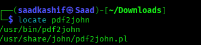
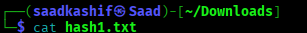
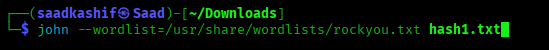

<div align="center">


# 🔐 Week 3 – Project Module 1
## Password Cracking with John the Ripper (JTR)


</div>

---

## 📖 Overview

This project documents how I recovered the password of a **protected PDF file** using **John the Ripper (JTR)** on **Kali Linux**, entirely through the terminal.

> 💡 I originally tried the **Windows GUI version (Johnny)** as instructed in the course material, but ran into a persistent bug where the tool kept spawning endless processes. After confirming with my instructor that this was not a common issue, I switched to completing the task via the **Kali Linux terminal** instead — which turned out to be simpler and more reliable.

---

## 🎯 Objective

- Understand how password-protected files store their protection as a **hash**.
- Learn how to extract that hash from a PDF file.
- Use **John the Ripper** to crack the hash and recover the original password.
- Reinforce why **strong, complex passwords** matter for real-world security.

---

## 🧰 Tools Used

| Tool | Purpose |
|---|---|
| 🐉 **Kali Linux** | Operating system used to run all commands |
| 🕵️ **John the Ripper (`john`)** | Password cracking tool |
| 📄 **pdf2john.pl** | Script bundled with JTR to extract a crackable hash from a PDF |
| 📋 **rockyou.txt** | Built-in Kali wordlist used for dictionary-based cracking |

---

## 🗂️ What is a "Hash"?

A **hash** is a scrambled, one-way representation of data (in this case, the password protection info inside the PDF). It **cannot be reversed directly** — instead, tools like John the Ripper generate guesses, hash each guess the same way, and compare it to the target hash. When they match, the password is found. 🔎

---

## 🪜 Step-by-Step Process

### **Step 1 — Navigate to the PDF file**

Move into the folder where the locked PDF is saved and confirm it's there.

```bash
cd ~/Downloads
ls
```

<p align="center">
  
</p>

📌 *This confirms we are in the correct working directory before running any JTR commands.*

---

### **Step 2 — Locate the `pdf2john` script**

John the Ripper can't read a PDF file directly — it first needs a **hash extracted** from it. JTR ships with a helper script for exactly this called `pdf2john.pl`. We locate its exact path on the system.

```bash
locate pdf2john
```

<p align="center">
  
</p>

📌 *Output confirms `pdf2john.pl` is available at `/usr/share/john/pdf2john.pl`.*

---

### **Step 3 — Extract the hash from the PDF**

Run the script against the target PDF, saving the extracted hash into a new text file.

```bash
perl /usr/share/john/pdf2john.pl "My Locked PDF1.pdf" > hash1.txt
```

Then verify the hash was captured correctly:

```bash
cat hash1.txt
```

<p align="center">
  
</p>

📌 *The hash should begin with `$pdf$` followed by a long alphanumeric string — this is what John will try to crack.*

---

### **Step 4 — Prepare the wordlist (rockyou.txt)**

Kali Linux includes a well-known wordlist called **rockyou.txt**, containing millions of real, previously leaked passwords. It ships compressed, so it needs to be unzipped once before use.

```bash
sudo gzip -d /usr/share/wordlists/rockyou.txt.gz
```

<p align="center">
  
</p>

> ⚠️ **Note:** If you see `No such file or directory`, it usually means the wordlist is **already unzipped**. Confirm with:
> ```bash
> ls -lh /usr/share/wordlists/ | grep rockyou
> ```

---

### **Step 5 — Crack the hash with John the Ripper**

Run John the Ripper against the extracted hash, using the rockyou wordlist for a dictionary attack.

```bash
john --wordlist=/usr/share/wordlists/rockyou.txt hash1.txt
```

<p align="center">
  
</p>

📌 *John compares every password in the wordlist against the hash until it finds a match.*

---

### **Step 6 — View the cracked password**

Once John finishes, display the recovered password:

```bash
john --show hash1.txt
```

---

### **Step 7 — Unlock the PDF**

Open the originally locked PDF and enter the recovered password to confirm it works. ✅

---

## 🧠 Key Learnings

- 🔓 **Encryption vs Hashing:** Encryption is two-way (can be decrypted with the right key), while hashing is one-way (used to verify, not reverse).
- 🖥️ **CLI over GUI:** When GUI tools misbehave, the terminal equivalent (`john` + `pdf2john`) is often faster and more stable.
- 🔑 **Password strength matters:** A weak or common password can be cracked in seconds using a dictionary attack — this is a strong real-world argument for using long, unique, random passwords.

---

## ⚠️ Disclaimer

This exercise was performed strictly for **educational purposes** in a controlled lab environment, on a file created specifically for this training task. Password cracking tools like John the Ripper should only ever be used on systems and files **you own or have explicit authorization to test.**

---

<div align="center">

### 🎓 Part of the Cybersecurity & Ethical Hacking Course
**Week 3 · Project Module 1 · Password Cracking with JTR**


</div>
