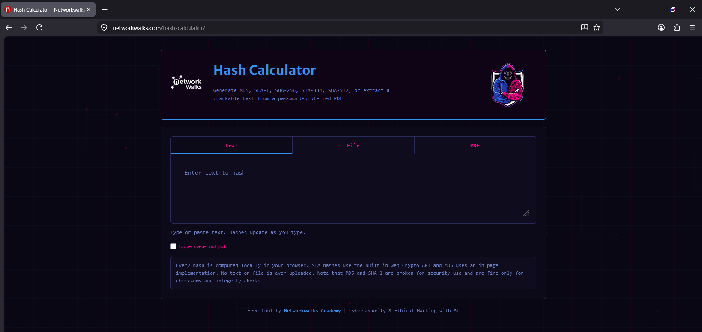
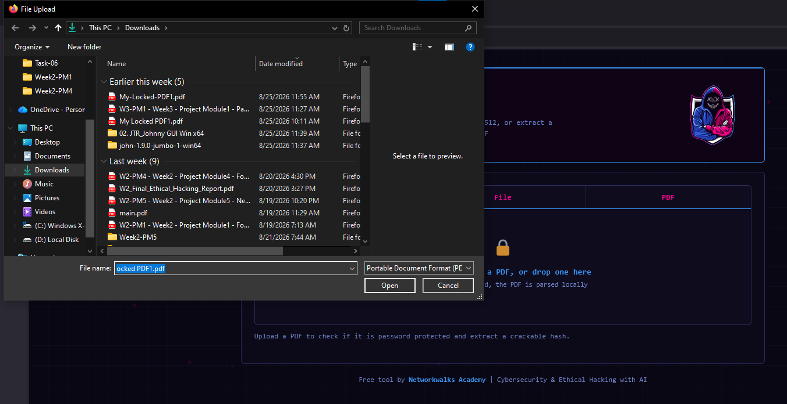
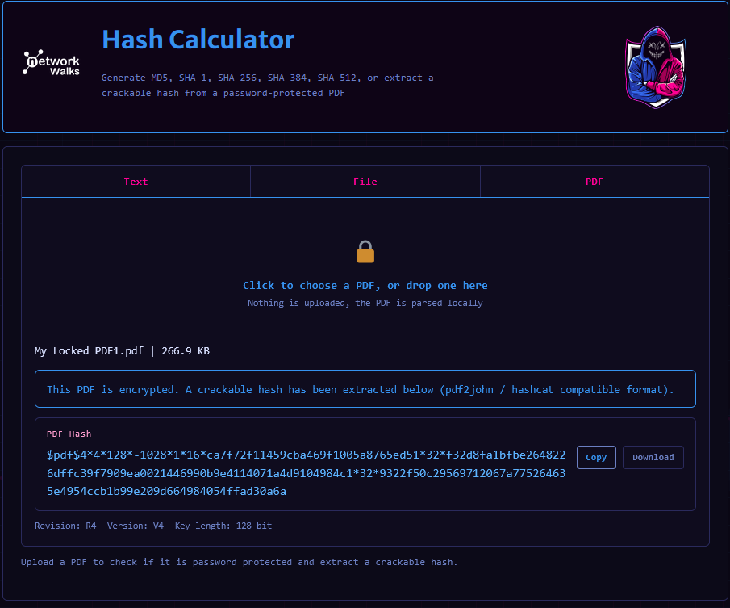
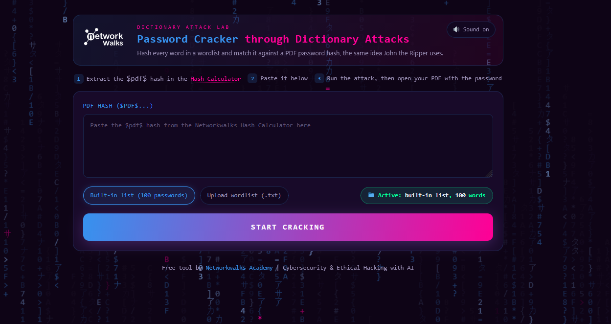
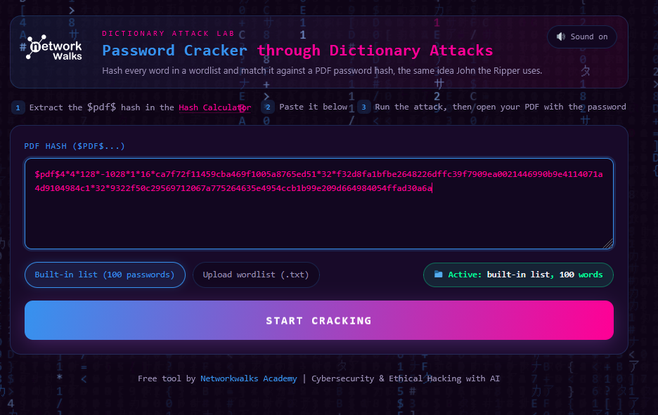
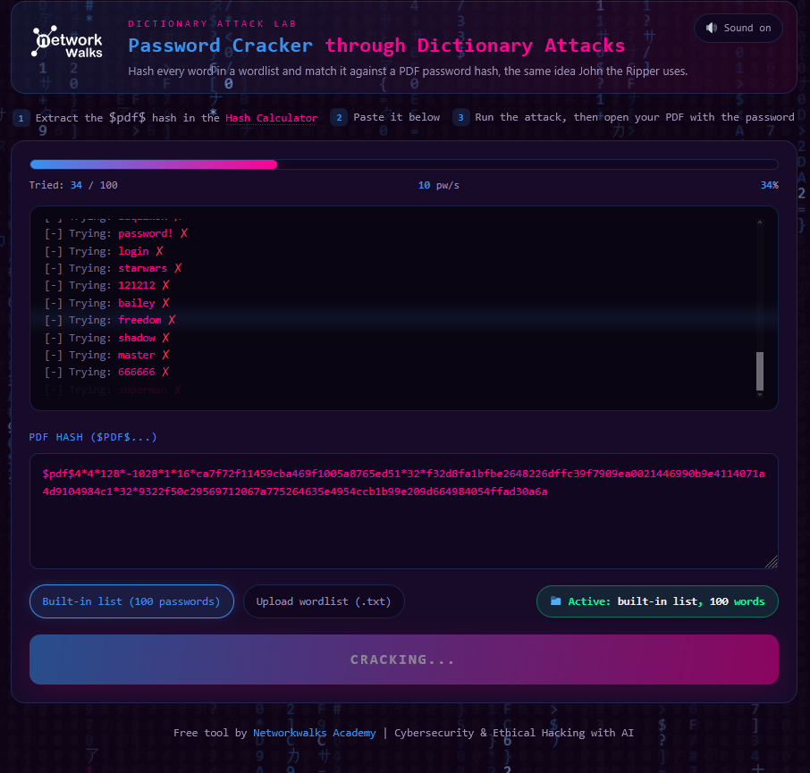
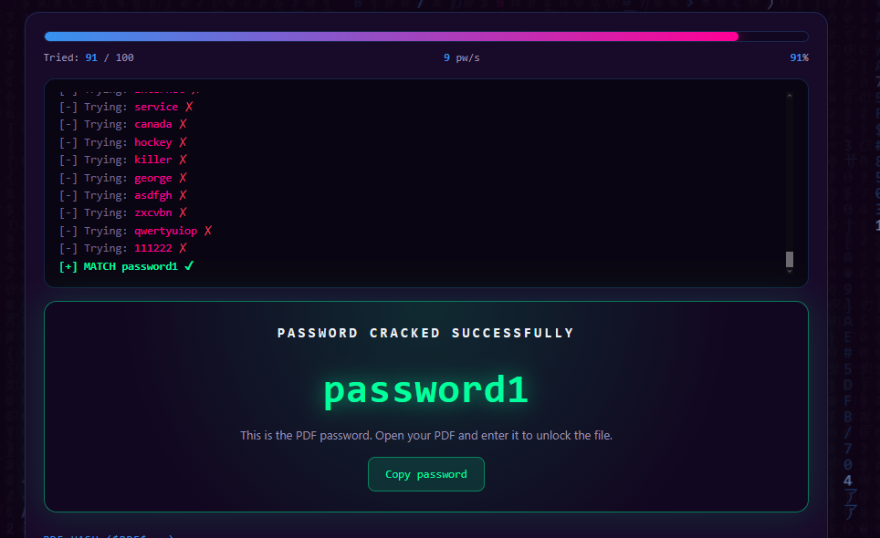

<div align="center">

# 🔐 Week 3 – Project Module 2
## Password Auditing with Networkwalks Web Tools (Internship Task)


</div>

---

## 📖 Overview

During my **internship**, I used two free browser-based tools built by **Networkwalks Academy** to demonstrate the exact same password-auditing concept as **John the Ripper (JTR)** — but entirely inside a web browser, with **no installation and no file ever leaving the local machine**.

The two tools used were:

| # | Tool | Purpose |
|---|---|---|
| 1️⃣ | 🧮 **Hash Calculator** | Extracts a crackable hash (`$pdf$...`) from a password-protected PDF |
| 2️⃣ | 🕵️ **Password Cracker – Dictionary Attack Lab** | Runs a dictionary attack against that hash to recover the original password |

> 💡 Both tools live at **networkwalks.com** and are described as running **fully client-side** — meaning all hashing and cracking happens locally in the browser using JavaScript / the Web Crypto API, so no PDF or password data is ever uploaded to a server.

---

## 🎯 Objective

- Understand how a **web-based hash extraction tool** can replicate what `pdf2john.pl` does on the command line.
- Understand how a **web-based dictionary attack tool** can replicate what `john --wordlist=...` does on the command line.
- Compare this **no-install, browser-only workflow** to the **terminal-based John the Ripper workflow** completed earlier in Project Module 1.
- Reinforce, once again, why **weak/common passwords** (like `password1`) are cracked almost instantly.

---

## 🧠 Concept Recap: What's a Hash, and Why Does It Matter?

| Term | Meaning |
|---|---|
| 🔒 **Hash** | A one-way scrambled "fingerprint" generated from data (here, the PDF's password-protection info). It cannot be reversed directly. |
| 📖 **Dictionary Attack** | A cracking method that hashes every word in a wordlist and compares it against the target hash, looking for a match. |
| 🎯 **Match Found** | Once a guessed word produces the *same* hash as the target, that word **is** the original password. |

This is precisely the logic John the Ripper uses internally — these Networkwalks tools just visualize that same process live in the browser. 🌐

---

## 🧰 Tools Used

- 🌍 **Google Chrome / Firefox** — browser used to access the tools
- 🧮 **Networkwalks Hash Calculator** → `networkwalks.com/hash-calculator/`
- 🕵️ **Networkwalks Password Cracker (Dictionary Attack Lab)** — linked directly from the Hash Calculator page
- 📄 **Target file:** `My Locked PDF1.pdf` (same protected PDF used in the JTR terminal task)

---

## 🪜 Step-by-Step Process

### **Step 1 — Open the Hash Calculator tool**

Navigated to `networkwalks.com/hash-calculator/`. The tool can generate **MD5, SHA-1, SHA-256, SHA-384, SHA-512** hashes from text or files, and — most importantly for this task — can also **extract a crackable hash directly from a password-protected PDF**.

<p align="center">
  
</p>

📌 *Note the reassurance on the page: "Every hash is computed locally in your browser... No text or file is ever uploaded."*

---

### **Step 2 — Switch to the PDF tab and upload the locked file**

Clicked the **PDF** tab, then clicked to browse and select the target file — `My Locked PDF1.pdf` — from the Downloads folder.

<p align="center">
  
</p>

📌 *This step is the browser equivalent of running `pdf2john.pl "My Locked PDF1.pdf"` in the terminal — except here it's done with a simple file picker.*

---

### **Step 3 — Extracted hash is generated automatically**

The moment the PDF was selected, the tool detected it was encrypted and instantly generated the crackable hash, along with useful metadata:

- **Revision:** R4
- **Version:** V4
- **Key length:** 128-bit

<p align="center">
  
</p>

📌 *The hash begins with `$pdf$4*4*128*...` — this is the exact same hash format that `pdf2john` produces, meaning it's fully compatible with John the Ripper or Hashcat too. A **Copy** and **Download** option is provided for convenience.*

---

### **Step 4 — Open the Password Cracker (Dictionary Attack Lab)**

From the Hash Calculator page, followed the link to the companion tool: **"Password Cracker through Dictionary Attacks."** Its description sums up the concept perfectly:

> *"Hash every word in a wordlist and match it against a PDF password hash — the same idea John the Ripper uses."*

The tool lays out **3 clear steps** at the top of the page:
1. Extract the `$pdf$` hash in the Hash Calculator
2. Paste it below
3. Run the attack, then open your PDF with the password

<p align="center">
  
</p>

---

### **Step 5 — Paste the hash and choose a wordlist**

Pasted the `$pdf$...` hash copied from the Hash Calculator into the input box. The tool offers two wordlist options:

- ✅ **Built-in list** (100 common passwords) — used here
- 📤 **Upload your own wordlist** (`.txt`) — for larger custom attacks

<p align="center">
  
</p>

📌 *This mirrors the terminal command:*
```bash
john --wordlist=/usr/share/wordlists/rockyou.txt hash1.txt
```
*...just using a smaller, built-in 100-word list instead of rockyou.txt.*

---

### **Step 6 — Start the dictionary attack**

Clicked **Start Cracking**. The tool then live-streamed every password attempt in a terminal-style console — showing each guess with a ❌ (no match) in real time, along with a progress bar and attempts-per-second speed.

<p align="center">
  
</p>

📌 *At this point it had tried 34 out of 100 words, running at roughly 10 passwords/second.*

---

### **Step 7 — Password successfully cracked**

After trying 91 of the 100 words, the tool hit a match: `password1`. It clearly flagged the successful attempt with `[+] MATCH password1 ✓` and displayed the result in a success banner with a **Copy password** button.

<p align="center">
  
</p>

✅ **Recovered Password:** `password1`

This matched exactly what was recovered earlier using the terminal-based John the Ripper method in **Project Module 1** — confirming both approaches are functionally identical under the hood.

---

## 🔍 Terminal (JTR) vs. Browser (Networkwalks Tools) — Comparison

| Step | John the Ripper (CLI) | Networkwalks Web Tools |
|---|---|---|
| Extract hash | `perl pdf2john.pl file.pdf > hash1.txt` | Upload PDF → Hash Calculator auto-extracts it |
| Run dictionary attack | `john --wordlist=rockyou.txt hash1.txt` | Paste hash → click **Start Cracking** |
| View result | `john --show hash1.txt` | Shown instantly in a success banner |
| Installation required? | ✅ Yes (Kali Linux + JTR) | ❌ No — runs entirely in the browser |
| Data leaves device? | ❌ No | ❌ No (client-side / local processing) |

---

## 🧠 Key Learnings

- 🌐 **Same concept, different interface:** Whether it's a terminal tool like John the Ripper or a browser-based tool, password cracking always comes down to the same core idea — **hash the guess, compare it to the target, repeat.**
- ⚡ **Speed depends on the wordlist:** A small 100-word built-in list cracked a weak password in seconds; a real-world attacker with a list like rockyou.txt (millions of entries) would do the same to any common password almost instantly.
- 🔐 **No-install auditing is powerful for quick checks:** Tools like these are great for fast demonstrations or awareness training without needing to set up Kali Linux.
- 🔑 **The real takeaway (again):** `password1` is a textbook example of a weak password — a strong, random, sufficiently long password would make this kind of dictionary attack fail completely.

---

## ⚠️ Disclaimer

This task was carried out strictly for **educational and internship training purposes**, using a PDF file created specifically for this exercise. Tools like the Networkwalks Hash Calculator and Password Cracker — just like John the Ripper — should only ever be used on **files and systems you own or are explicitly authorized to test.**

---

<div align="center">

### 🎓 Part of the Cybersecurity & Ethical Hacking Internship
**Week 3 · Project Module 2 · Password Auditing with Networkwalks Tools**


-informational?style=flat-square)

</div>
