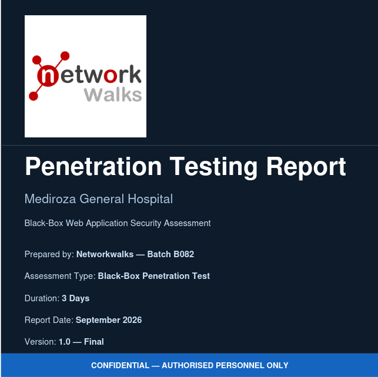

# 🔐 Week 4 — Authorized Penetration-Testing Assessment

**NetworkWalks Internship — Batch B082**

## 📄 Report

[Download the complete Week 4 penetration-testing report](https://github.com/saadkashif049-wq/NetworkWalks-B02/blob/main/Week4/Mediroza_Pentesing_Rport.pdf)

## 🎯 Overview

During Week 4 of my cybersecurity internship with **NetworkWalks**, I completed an authorized black-box web application penetration-testing assessment in a controlled educational environment.

The engagement was designed to develop practical skills in reconnaissance, web application assessment, access-control review, password-strength analysis, sensitive-data exposure analysis, risk rating, and professional security reporting.

> **Responsible disclosure notice:** This public repository contains only a sanitized project summary. No patient information, credentials, passwords, database records, private client data, or exploit-sensitive evidence is included.

## 🧠 Personal Learning Journey

The first day was challenging. I performed reconnaissance and tested different possibilities, but I could not make meaningful progress and nearly gave up.

On the second day, I changed my approach and studied the application behavior more carefully. That persistence led to the breakthrough required to continue the assessment and complete all four milestones.

The main lesson I took from the engagement was:

> **When the first approach does not work, reassess the situation, keep learning, and continue methodically.**

Penetration testing requires more than knowing security tools. It also requires patience, curiosity, critical thinking, and the ability to investigate a problem from more than one perspective.

## ✅ Completed Milestones

### 🔎 Milestone 1 — Initial Access and Application Assessment

I performed passive and active reconnaissance, including domain information review, DNS enumeration, service discovery, web technology identification, and directory enumeration.

The assessment identified an authentication and input-handling weakness in a web application. Within the authorized scope, I validated that confidential laboratory-report resources could be accessed without the intended level of protection.

**Skills practiced:**

- Reconnaissance and attack-surface mapping
- Service and web enumeration
- Authentication testing
- Input-handling analysis
- Access-control validation

### 🔓 Milestone 2 — PDF Protection and Password Recovery

The recovered laboratory reports were protected with PDF encryption. I reviewed their metadata and evaluated the strength of the file passwords through offline testing.

PDFCrack and an industry-standard wordlist were used to recover the passwords. Successful access to the protected report contents was then verified and documented in the private assessment report.

**Skills practiced:**

- File and metadata analysis
- Password-strength assessment
- Offline security testing
- Evidence validation
- Responsible handling of sensitive documents

### 🗄️ Milestone 3 — Sensitive Data Exposure Analysis

By reviewing discoverable web paths and directory configurations, I identified an exposed database backup file.

The backup contained sensitive organizational information, including staff employment and salary records and commercially sensitive shareholder information. The finding demonstrated the risks of storing backups in web-accessible locations without appropriate access controls.

**Skills practiced:**

- Sensitive-file discovery
- Backup exposure analysis
- Data classification
- Business-impact assessment
- Remediation prioritization

### 📝 Milestone 4 — Professional Penetration-Testing Report

I consolidated the assessment into a structured penetration-testing report designed for both technical and non-technical readers.

The report includes:

- Executive Summary
- Scope and Methodology
- Assessment Limitations
- Findings and Supporting Evidence
- Risk Ratings
- Business Impact Analysis
- Prioritized Remediation Recommendations
- Technical Appendices

## 📊 Finding Categories

The private report documented findings across the following categories:

| Category | Risk level |
|---|---|
| Authentication and access-control weakness | Critical |
| Publicly accessible database backup | Critical |
| Weak PDF password protection | High |
| Directory listing | Medium |
| Sensitive path disclosure | Medium |
| Username enumeration | Medium |
| Verbose error messages | Low |

The detailed evidence and affected target information are intentionally excluded from this public repository.

## 🛠️ Tools and Techniques

The engagement involved the following tools and techniques:

- Nmap
- Gobuster
- Wafw00f
- Burp Suite
- Curl
- PDFCrack
- ExifTool
- Browser-based validation
- Linux command-line utilities

Tools were used only within the authorized assessment scope and for educational purposes.

## 💡 Key Takeaways

This engagement helped me strengthen my practical understanding of:

- Reconnaissance and attack-surface analysis
- Web application security testing
- Authentication and access-control weaknesses
- SQL injection validation
- Password-strength assessment
- Sensitive-file exposure
- Evidence management
- Risk prioritization
- Technical report writing
- Communicating security findings clearly

The most important outcome was learning to remain methodical when the first approach fails. A successful assessment is not only about finding a weakness; it is also about validating risk responsibly, protecting sensitive information, and providing useful remediation guidance.

## 🔒 Disclosure and Data-Handling Statement

This project was performed in an authorized, controlled educational environment. The public version has been sanitized to protect confidential information.

The following materials are **not** included in this repository:

- Patient names or medical information
- Passwords or credentials
- National identification numbers
- Phone numbers or email addresses
- Staff salary values
- Shareholder names or exact ownership records
- Raw database backups
- Unredacted screenshots
- Private target details or exploit payloads

The complete report is intended only for the authorized internship or academic review process.

## 🙏 Acknowledgement

Thank you to the **NetworkWalks** team for providing a realistic and valuable environment in which to develop practical penetration-testing and professional reporting skills.

## ⚠️ Disclaimer

This repository is for educational and portfolio purposes only. The techniques discussed in the private assessment must never be used against systems without explicit written permission from the owner.

---

**Week 4 completed. Looking forward to Week 5.**

#CyberSecurity #PenetrationTesting #WebApplicationSecurity #InformationSecurity #OWASP #NetworkWalks #CybersecurityInternship #TechnicalReporting #ResponsibleDisclosure
